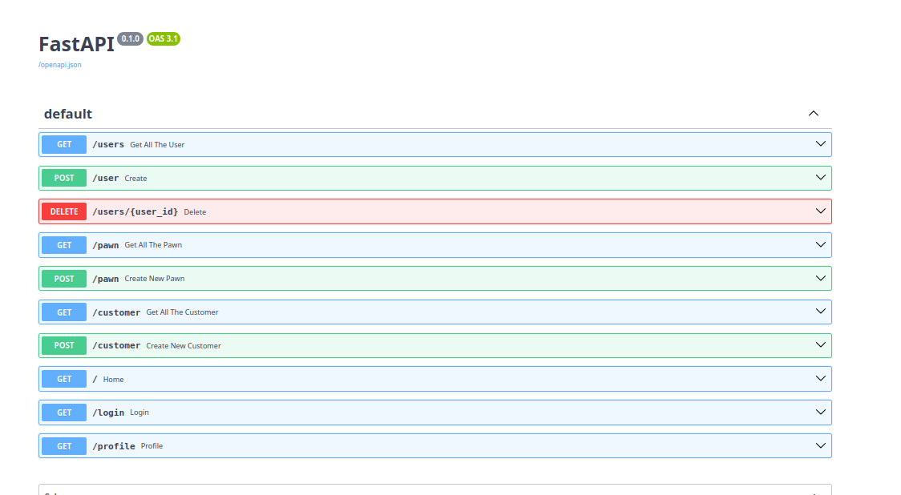
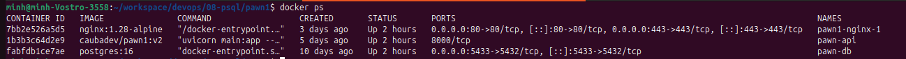
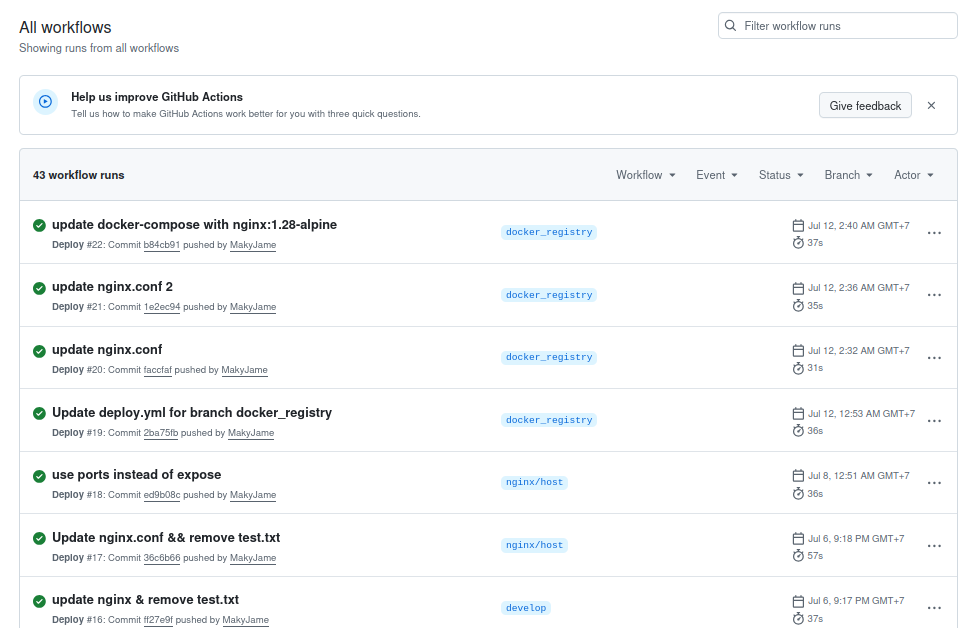
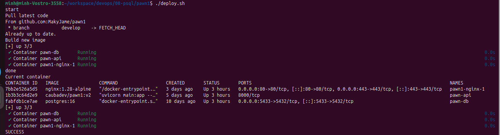

# Pawn Management System

Production-ready Pawn Management System built with **FastAPI**, **PostgreSQL**, **Docker**, **Alembic**, **Nginx**, and **GitHub Actions**.

---

## Live Demo

Application

https://camdotuanly.site

Swagger API

https://camdotuanly.site/docs

---

# Screenshots

## Swagger UI



---

## Docker Containers



---

## CI/CD Pipeline



---

## Infrastructure Architecture


---

## Production Deployment



---

# Features

- RESTful API with FastAPI
- PostgreSQL Database
- SQLAlchemy ORM
- Alembic Database Migration
- Docker Compose Multi-container
- Nginx Reverse Proxy
- HTTPS with Let's Encrypt
- GitHub Actions CI/CD
- Docker Registry Deployment
- Production-ready VPS deployment

---

# Tech Stack

| Category | Technology |
|-----------|------------|
| Backend | FastAPI |
| Language | Python 3 |
| Database | PostgreSQL 16 |
| ORM | SQLAlchemy |
| Migration | Alembic |
| Reverse Proxy | Nginx |
| Container | Docker |
| Orchestration | Docker Compose |
| CI/CD | GitHub Actions |
| Cloud | Vultr VPS |
| SSL | Let's Encrypt |

---

# Architecture

```text
                   Internet
                       │
                       ▼
              Nginx Reverse Proxy
                       │
                HTTPS (443)
                       │
                       ▼
             FastAPI Container
                       │
                 SQLAlchemy ORM
                       │
                      ▼
             PostgreSQL Container
```

---

# Project Structure

```text
pawn1
│
├── alembic
├── models
├── repositories
├── routers
├── services
├── nginx
├── Dockerfile
├── docker-compose.yml
├── deploy.sh
└── README.md
```

---

# Quick Start

Clone project

```bash
git clone https://github.com/MakyJame/pawn1.git
cd pawn1
```

Create environment file

```bash
cp .env.example .env
```

Run

```bash
docker compose up -d --build
```

Swagger

```
http://localhost:8000/docs
```

---

# Environment Variables

```env
DATABASE_URL=
POSTGRES_USER=
POSTGRES_PASSWORD=
POSTGRES_DB=
```

---

# Database Migration

Generate migration

```bash
alembic revision --autogenerate -m "message"
```

Upgrade

```bash
alembic upgrade head
```

Rollback

```bash
alembic downgrade -1
```

---

# Deployment Workflow

```text
Developer

      │

git push

      │

GitHub Actions

      │

Docker Image

      │

Docker Hub

      │

VPS

      │

docker compose pull

      │

docker compose up -d

      │

Application Running
```

---

# Branch Strategy

| Branch | Purpose |
|---------|----------|
| main | Stable code |
| develop | Active development |
| docker_registry | Production deployment |

---

# Future Improvements

- JWT Authentication
- Refresh Token
- RBAC
- Prometheus
- Grafana
- Loki
- Traefik
- Kubernetes
- Helm
- Terraform

---

# Author

**Doan Tai**

Backend / DevOps Engineer

GitHub

https://github.com/MakyJame

Project

https://github.com/MakyJame/pawn1
